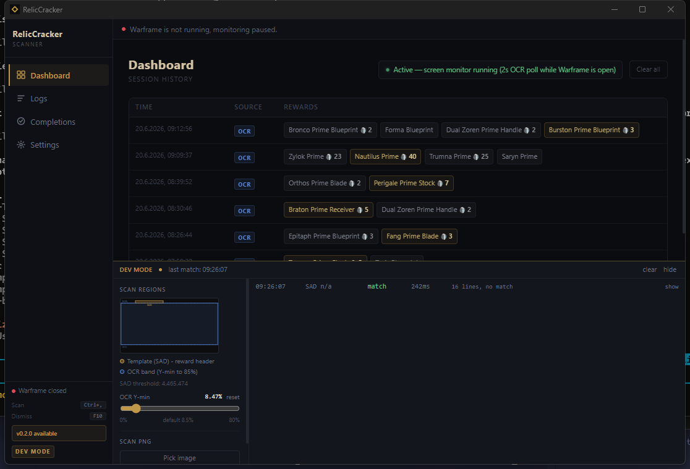
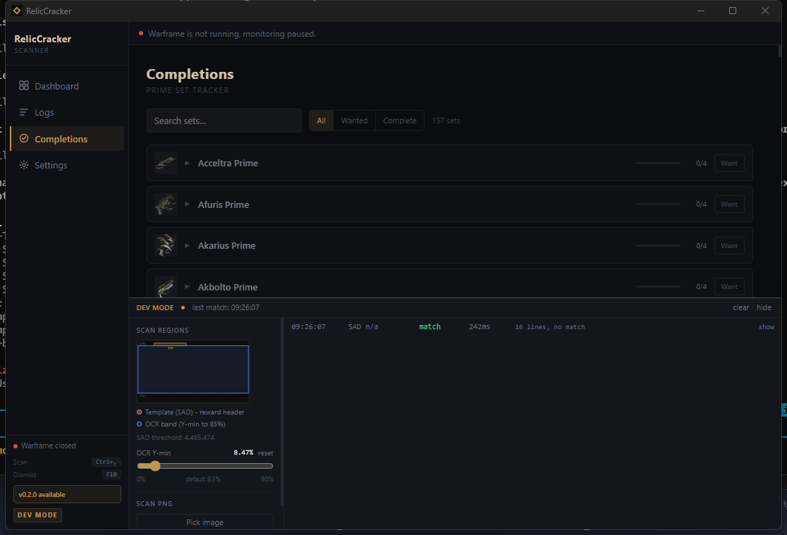
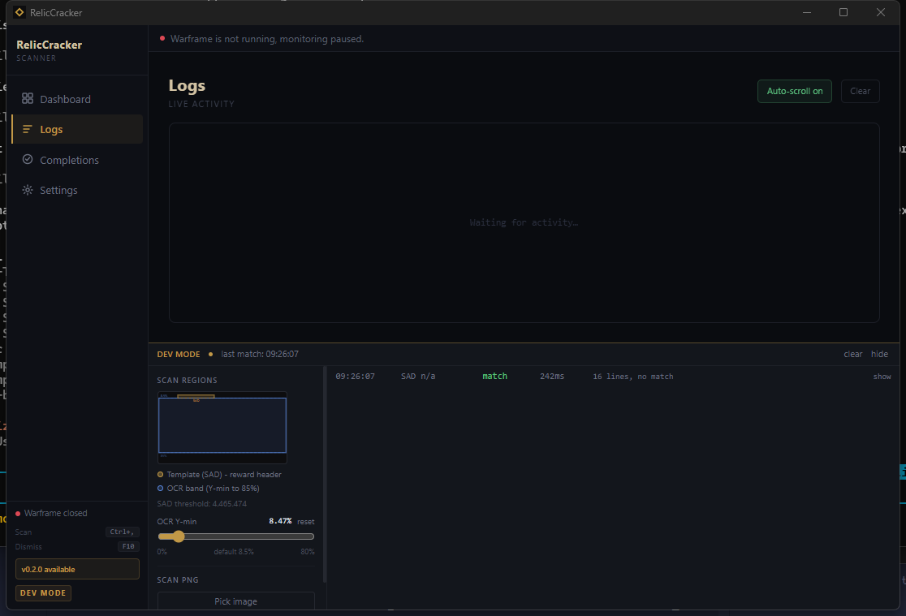
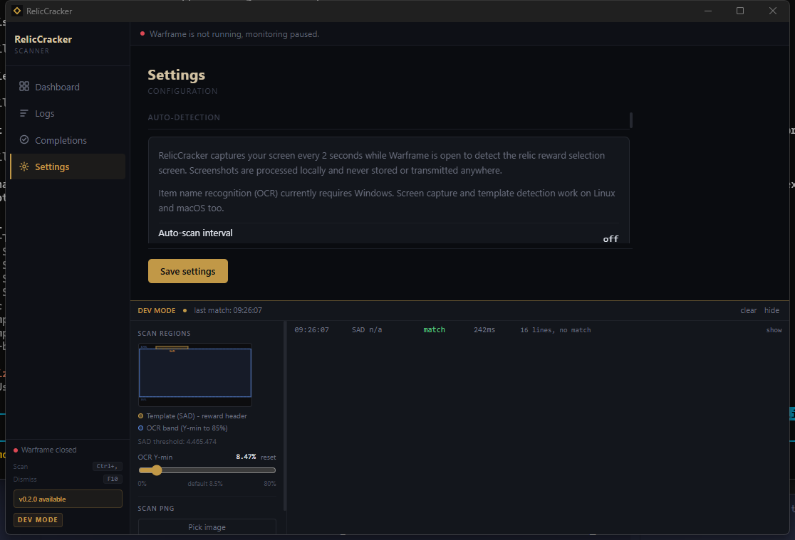

# RelicCracker

> **Work in progress** — not ready for general use.

Warframe relic reward overlay. When you crack a relic, it shows platinum prices and ducat values for each reward before you pick one.

## Screenshots

| Dashboard | Completions |
|:---:|:---:|
|  |  |

| Logs | Settings |
|:---:|:---:|
|  |  |

## What it does

- Detects the reward screen automatically via template matching + OCR (Windows and Linux)
- Shows a small always-on-top overlay with prices from warframe.market
- Highlights the best pick with a configurable preference (max plat, max ducats, or set completion)
- Shows price trend (rising/falling) and vault status
- Saves session history so you can review past runs
- Tracks Prime set completion progress with per-component plat and ducat values
- Notifies you when a new version is available on GitHub

## Platform support

| Platform | Screen detection | OCR | Overlay |
|---|---|---|---|
| Windows 10/11 | yes | yes (Windows.Media.Ocr) | yes |
| Linux (X11/Wayland) | yes | yes (Tesseract) | yes |

On Linux, install `tesseract-ocr` and the appropriate language data package (e.g. `tesseract-ocr-eng`) before running. EE.log watching (Settings) works on all platforms as an additional detection path.

## Build

Requires [Rust](https://rustup.rs/) and [Node.js](https://nodejs.org/).

```sh
npm install
npm run tauri build
```

Dev server with hot reload:

```sh
npm run tauri dev
```

### Releases

Pre-built binaries for Windows, macOS (universal), and Linux are attached to each [GitHub release](https://github.com/Tiltann/RelicCracker/releases). The app checks for updates on startup.

## Usage

1. Launch RelicCracker
2. Open Warframe and crack a relic
3. The overlay appears automatically at the reward screen
4. Pick your item — the overlay dismisses itself after a few seconds, or press `F10`

Manual scan: `F9`

Settings (hotkeys, auto-dismiss timer, language, scan interval) are in the app sidebar.

## Game language

Change the language in Settings if your Warframe client isn't in English. This switches both the OCR language pack and the item database so names match correctly.

Supported: English, Deutsch, Français, Español, Italiano, Polski, Português, Русский, 한국어, 中文 (Simplified/Traditional).

## How detection works

1. Screen is captured on a configurable interval while Warframe is running
2. A template SAD (sum of absolute differences) check discards non-reward frames instantly
3. OCR reads item names from the lower portion of the screen (60–85% height) — Windows.Media.Ocr on Windows, Tesseract on Linux
4. Names are matched against the warframestat.us item database; Levenshtein fallback handles OCR typos
5. Prices are fetched in parallel from warframe.market's 48h statistics endpoint

## Data sources

- Item names and ducat values: [warframestat.us](https://warframestat.us) (community API, [WFCD](https://github.com/WFCD))
- Prices: [warframe.market](https://warframe.market)

## Built with

- [Tauri 2](https://tauri.app/) — app framework (Rust + WebView2)
- [React 19](https://react.dev/) + [TypeScript](https://www.typescriptlang.org/)
- [Tailwind CSS v4](https://tailwindcss.com/)
- [windows-rs](https://github.com/microsoft/windows-rs) — Windows.Media.Ocr bindings
- [leptess](https://github.com/houqp/leptess) — Tesseract OCR bindings (Linux)
- [xcap](https://github.com/nashaofu/xcap) — cross-platform screen capture
- [reqwest](https://github.com/seanmonstar/reqwest) — HTTP client

## Trademark notice

This project is not affiliated with or endorsed by Digital Extremes Ltd. Warframe and all related names, logos, and images are trademarks or registered trademarks of Digital Extremes Ltd.

The platinum and ducat icons used in this app are property of Digital Extremes Ltd. and are used here for identification purposes only under fair use, as this is a free, open-source fan tool.

## License

MIT — see [LICENSE](LICENSE).

This license applies to the source code only. Game assets (icons, names, item data) remain the property of Digital Extremes Ltd.

---

<sub>Developed by [Tiltann](https://github.com/Tiltann) with assistance from [Claude](https://claude.ai) (Anthropic).</sub>
